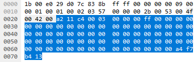

# Joystick Input Examples
This guide aims to provide everything you need to know about implementing joystick input in PC games. Prerequisites: familiarity with [Windows programming](https://en.wikibooks.org/wiki/Windows_Programming/Handles_and_Data_Types) and C-style C++.

TLDR: if you're a solo indie developer who just wants good basic joystick support, use SDL Game Controller. It's a well designed library that offloads tons of headaches.

The `src` folder contains small example programs to illustrate implementation details. You can build the Windows examples in Visual Studio by opening `Joystick Input Examples.sln` in the `vs` folder, or by running the `build` batch files with a Visual Studio developer command line. The [combined.cpp](src/combined.cpp) example uses RawInput and XInput to demonstrate a more complete Windows implementation. You can build the Linux examples by running `make`.

Special thanks to Handmade Network for fostering a community that values exploring details, as well as Martins for sharing his limitless knowledge.

## Table of Contents
- [Types of Devices](#types-of-devices)
	- [HID](#hid)
	- [XInput](#xinput)
- [Inputs](#inputs)
- [Outputs](#outputs)
- [Windows APIs](#windows-apis)
	- [Multimedia](#multimedia)
	- [DirectInput](#directinput)
	- [RawInput](#rawinput)
	- [XInput](#xinput-1)
	- [WinRT](#windows-runtime-uwpwindowsgaminginput)
	- [GameInput](#gameinput)
- [Windows Specialized I/O](#windows-specialized-io)
	- [Dualshock 4](#dualshock-4)
 	- [Dualsense](#dualsense)
	- [XBox Controllers](#xbox-controllers)
- [Linux APIs](#linux-apis)
	- [Joydev](#joydev)
	- [Evdev](#evdev)
- [Libraries](#libraries)
	- [SDL](#sdl)
	- [Steam](#steam)
- [Button Configuration](#button-configuration)
	- [Controller Database](#controller-database)
	- [Calibration](#calibration)
	- [Cutting Our Losses](#cutting-our-losses)
- [Detecting Device Changes](#detecting-device-changes)
- [Displaying Physical Buttons](#displaying-physical-buttons)

## Types of devices

### HID
Standing for Human Interface Device, HID is a standardized communication protocol for USB devices a user directly interacts with, covering anything from keyboards to treadmills. An HID `usage page` is a number describing the purpose of the device, and `usages` are further subcategories. Modern game controllers use HID usage page 1 (generic desktop) with usage 0x04 (Joystick) or 0x05 (Gamepad), and Windows has several APIs for working with them. You can read the [official usage table from usb.org](https://usb.org/sites/default/files/hut1_21_0.pdf), or [this more concise reference](http://www.freebsddiary.org/APC/usb_hid_usages.php).

HID refers to the standard protocol, physical devices (the gamepad in your hands), and virtual devices. Games interface with the virtual device while a driver handles communicating those bytes to the physical one. I'll be redundantly referring to game controllers as HID devices.

### XInput
The only controllers you're likely to find that don't use HID are Microsoft's own XBox controllers. These use a custom communication protocol, and Microsoft introduced a new API to work with them. We'll refer to the driver, the API, and the protocol as XInput. It supports up to 4 controllers at a time, with a light on the controller indicating the player index.

The XInput API is one of the simplest APIs Microsoft has ever made and is extremely easy to use, but it only works with XBox controllers. This is nice for indie developers as XBox controllers are a small, consistent subset of the wide world of USB game controllers, and doing XBox support well is significantly easier than supporting all possible controllers. The downside is alienating players who only have a PS4 controller, or some other controller that uses HID.

XBox controllers also work on older games that only implemented support for HID. The XInput driver creates a virtual HID device and forwards inputs to it. Effectively there are two copies of each XBox controller on your system, the XInput version and the HID version. The HID version comes with a big, annoying downside: the XInput driver combines both shoulder tiggers into one axis when converted to HID. Pressing RT makes the axis go in the negative direction, and LT makes it go in the positive direction. If you press both at the same time, it's the same as pressing neither.

## Inputs
The basic inputs on joysticks are
- Buttons, delivered as bitflags, booleans, or a list of which are pressed.
- Values for analog sticks and shoulder trigger axes, delivered as signed or unsigned integers. Analog sticks have 2 axes and triggers have one.
- A POV hat for the d-pad. This can be implemented as bitflags or an integer representing a direction, such as 1 to the north, 2 to north-east, 3 to east, etc. and 0 for being centered.

Just like how HID devices are described by a usage page and usage, each input on an HID device is also described by a usage page and usage. The standard usages for values are X, Y, Z, Rx, Ry, Rz, Dial, Slider (usages 0x30-0x37 on usage page 1), and Hat Switch (0x39). The only consistant ones are X and Y for the left analog stick, and Hat Switch for Dpad; the rest are arbitrary and their names don't have much practical meaning these days. Buttons are on usage page 9 with each button getting its own usage, starting at 0x01. Subtract 1 from the usage and you'll have the corresponding button index in most APIs.

Analog sticks are sensitive and produce small input values even when at rest. Deadzones are used to ignore the input until it passes a threshold; for example, `if(axis<0.2 && axis>-0.2) axis=0`. Deadzones can be applied to individual axes, or both analog stick axes together for [better results](https://www.gamasutra.com/blogs/JoshSutphin/20130416/190541/Doing_Thumbstick_Dead_Zones_Right.php).

Joysticks may support non-standard inputs such as touchpads and accelerometers. For HID devices, these are delivered along with standardized data, but are specific to the device and must be reverse-engineered. See [Specialized I/O](#specialized-io) for how to access device-specific data.

## Outputs
Outputs are usually non-standard extensions, such as
- Force feedback, a.k.a. rumble or haptics
- LEDs
- Audio

Specialty devices like flightsticks support HID force feedback, but not the controllers currently popular for games; XBox and PS4 controllers can't do rumble through HID. XInput provides a function to cause rumble on XBox controllers. You can set rumble and LED color on PS4 controllers by directly writing reverse-engineered data through RawInput.

Some APIs have "Effects" for force feedback that get generalized and complex, but XBox and PS4 rumble is activated through two simple linear values—one for each motor in the gamepad. If a program never turns off rumble, XBox controllers will stop rumbling when the program terminates. PS4 controllers will continue to rumble on Windows, but stop after a few seconds of receiving no instructions.

## Windows APIs
On Windows 10, you can use the Windows Runtime API to get correct input from both XInput and HID devices. To support older versions of Windows, you will need to use the XInput API to get input from XBox controllers with correct shoulder trigger values, along with one of the HID APIs to get input from other types of controllers. When enumerating connected HID devices, you can check which ones are XBox controllers and ignore them with the HID API, then use XInput to process them. There's unfortunately no way to associate a virtual HID device with an XInput player index.

### [Multimedia](https://docs.microsoft.com/en-us/windows/win32/multimedia/joysticks)
Multimedia Joystick is the simplest HID API for Windows. The `Ex` version of the functions and structs support up to 16 controllers at a time, each with up to 32 buttons, 6 axes, and a hat.

Getting the joystick state is one function call to `joyGetPosEx`, which takes a device index and a struct to fill with data. The device index ranges 0-15, and a joystick can be assigned any index, even if it's the only one connected at the time. You'll have to check all of the indices to find which are in use.

Multimedia's functionality is quite limited. It doesn't have any force feedback support, and is missing two axes (Dial and Slider) that are used by some controllers. It also doesn't give you handles to hardware, so you can't easily tell what's an Xbox controller to use XInput instead.

The `JOYCAPS` struct does contain vendor ID (`wMid`) and Product ID (`wPid`). These could be compared against a list of known XBox controller IDs. In addition, they can be used to look up the joystick's name in the registry. See [this example](https://github.com/Tasssadar/libenjoy/blob/master/src/libenjoy_win32.c#L50) in Vojtěch Boček's `libenjoy`.

### [DirectInput](https://docs.microsoft.com/en-us/previous-versions/windows/desktop/ee416842(v=vs.85))
DirectInput is lower level and gives a bit more control. It uses a COM interface, so you'll be creating an object that's used to create other objects. First create a DirectInput object with `DirectInput8Create()`. You can use `IDirectInput*` or `IDirectInput8*`; the `8` versions give access to full features, though those features are not used in the [directinput.cpp](src/directinput.cpp) example.

To find available joysticks you'll have to enumerate them through a callback function. DirectInput will invoke this function once for each joystick plugged into your machine.

[MSDN provides a function](https://docs.microsoft.com/en-us/windows/win32/xinput/xinput-and-directinput) to check if a device is an XBox controller while enumerating HID devices. It searches through all devices on the system to see if they have "IG_" in the device name. If it does, it compares the product and vendor IDs to the direct input device passed into the function, and, if they match, returns that the device is an XBox controller.

One you've accuired devices, you can call `GetDeviceState` on them to fill a [DIJOYSTATE struct](https://docs.microsoft.com/en-us/previous-versions/windows/desktop/ee416627(v=vs.85)) with the current state of inputs on the controller. The value members of the struct have names corresponding to their HID usages, except for Dial, which is combined with Slider in an array of two elements.

Device Caps, short for capabilities, contains information about what features the device has, such as number of buttons.

DirectInput has an "Effects" interface for HID force feedback. Good for flightsticks, but there's no support for XBox or Playstation controller rumble.

### [RawInput](https://docs.microsoft.com/en-us/windows/win32/inputdev/raw-input)
The first step with RawInput is registering to receive `WM_INPUT` events. Unlike the other APIs, RawInput uses an event queue to get inputs. This has a distinct advantage of being able to get inputs that may have been missed between frames, such as a button being quickly pressed and released (though most games don't worry about this; it would have to be running well under 30fps for players to notice). To register for events, fill out one or more `RAWINPUTDEVICE` structs and pass an array of them to RegisterRawInputDevices(). The structs take the HID usage page and usages of devices for which to receive events, bit flags, and a handle to the window whose window procedure will receive the events. You can use your game window's existing procedure, or create a non-visible window to encapsulate joystick code. The [rawinput](src/rawinput.cpp), [specialized](src/specialized.cpp), and [combined.cpp](src/combined.cpp) examples use a non-visible window to get events in a terminal-based program.

The `lParam` for a `WM_INPUT` message is a handle to the RawInput data for that event. Each `WM_INPUT` has its own RawInput data, so if it takes longer to process an event than the update frequency of the joystick, the queue can get seriously backed up. Also, each event's RawInput data contains the entire state of the controller, so you may only want to process the latest one.

As an alternative to handling `WM_INPUT` events, you can use `GetRawInputBuffer()` to get an array of all queued `RAWINPUT` data. Unfortunately, it has some alignment quarks. If you compile your program for x86 and run on an x64 machine, the `RAWINPUT` data will be missaligned. You can play around with this in the [rawinput_buffered.cpp](src/rawinput_buffered.cpp) example.

Pass the RawInput data handle to GetRawInputData to get the actual input buffer, along with a handle to the RawInput device that can be used to get more information about it.

[Preparsed Data](https://docs.microsoft.com/en-us/windows-hardware/drivers/hid/preparsed-data) describes what kind of data is in the input buffer. We can pass the preparsed data along with the input buffer to the `HidP_*` set of functions to extract analog and digital values. The [rawinput.cpp](src/rawinput.cpp) example prints out all available analog values, while the [combined.cpp](src/combined.cpp) example looks at usages to determine which values correspond to analog sticks and triggers on a typical HID joystick.

The [documentation for all this on MSDN](https://docs.microsoft.com/en-us/windows-hardware/drivers/ddi/_hid/) is pretty sparse and hard to understand. Open up hidpi.h for much better explanations. But I'm still not sure how the buttons and values are technically supposed to be parsed. There's a lot of strange nuance, like the return value of `HidP_GetUsageValue` is unsigned, but `LogicalMin` and `LogicalMax` of the value cap is signed. My XBox controller, through HID, says logical min is 0 and logical max is -1. I'm guessing that these were reinterpreted and sign extended from a smaller unsigned type. For the combined example, I assumed the value range is `[0, (2^bitsize)-1]`, but I don't know if this is true for all controllers.

### [XInput](https://docs.microsoft.com/en-us/windows/win32/xinput/xinput-game-controller-apis-portal)
XInput is a simple API similar to multimedia joystick. It only works with XBox controllers, but makes getting controller state and setting rumble nice and easy.

XInputGetState() has been known to cause a several millisecond hang when trying to access non existent devices, for example, asking for player 2 input when only player 1 is plugged in. You'll probably want to query which controller indices are available once, and only get regular updates from devices you know are connected. See the [Detecting Device Changes](#detecting-device-changes) section for more details.

[There are several versions of XInput](https://docs.microsoft.com/en-us/windows/win32/xinput/xinput-versions). v9.1.0 (link with xinput9_1_0.lib) ships with Windows Vista and later. v1.4 (link with xinput.lib) ships with Windows 10 and later. For v1.3, you would have to provide a DLL to users along with your application.

### [Windows Runtime (UWP/Windows.Gaming.Input)](https://docs.microsoft.com/en-us/uwp/api/windows.gaming.input)
This API is part of Microsoft's Universal Windows Platform, and is available starting on Windows 10. It is a "modern C++" design, so it does not have bindings for C or C++ versions earlier than C++17.

The Windows.Gaming.Input API has classes for several kinds of controllers, including ArcadeStick, FlightStick, Gamepad, and RacingWheel, giving you access to semantic information about their inputs. The downside is that these will only work with a few specific devices (mostly devices for XBox). As an example, my Playstation 3 arcade stick is not available as a `winrt::Windows::Gaming::Input::ArcadeStick`. All of the devices available in these specialized classes will also be accessible through RawGameController. This class supports HID devices, but also uses XInput for XBox controllers, so it reports correct values for the XBox shoulder triggers and supports force feedback on XBox controllers.

[winrt.cpp](src/winrt.cpp) shows an example of RawGameController. To work with XBox controllers, the application must have an open window. If you run [winrt.cpp](src/winrt.cpp) with an XBox controller connected and close "Input Focus Window" without exiting the application, it may randomly crash. This error is also randomly logged in visual studio: `onecoreuap\xbox\devices\api\winrt\pnpdevicewatcher.cpp(500)\Windows.Gaming.Input.dll!78772CC8: (caller: 78772675) ReturnHr(1) tid(3544) 80070006 The handle is invalid.` It is a problem with running as a console application, but doesn't appear to cause any harm.

Each of the classes has a static function to get a list of all connected devices of its own type. To get all connected XBox controllers, call `winrt::Windows::Gaming::Input::Gamepad:Gamepads()`. However, this list can change at any time when a device is connected or disconnected. As far as I can tell, there's no way to make use of this list without risking out-of-bounds access to the array. While I haven't seen it crash the program, I have seen the API stop reporting all game controller data after an out-of-bounds access, for the remainder of the program's execution.

Instead, it seems better to use the `Added` and `Removed` callback events to keep track of your own list. These are still asynchronous and called in their own thread, but they allow you to wrap any access to the controller list in a critical section. When you set up the `Added` callback event, the callback will be invoked for each controller already connected to the system.

You can continue reading from instances of controllers even after they are disconnected; they will return inputs as all zeros.

The `GetButtonLabel()` method of each class returns a semantic for the specified button (see [Displaying Physical Buttons](#displaying-physical-buttons)) as an enumeration value. The [GameControllerButtonLabel](https://docs.microsoft.com/en-us/uwp/api/windows.gaming.input.gamecontrollerbuttonlabel) enum has all the XBox buttons you would expect, but also Cross, Circle, Square, and Triangle—the buttons on Playstation controllers. Unfortunately, these are not available by default: my PS4 controller returns `None` for every button. It would allow Sony to write their own PlaystationController class as a library for developers, but I don't believe they have done so at time of writing.

### [GameInput](https://learn.microsoft.com/en-us/gaming/gdk/_content/gc/input/overviews/input-overview)
Similar to Windows.Gaming.Input, GDK GameInput aims to combine HID and XInput into one easier-to-use interface, with categoris such as Gamepad, Racing Wheel, and Arcade Stick for devices Microsoft recognizes, and "Controller" being the catch-all. At time of writing, [it does not work with XBox 360 controllers](https://github.com/microsoft/GDK/issues/39), and the controller's name to display to users is null for every device I own.

You will need the [NuGet package containing GameInput.h and GameInput.lib](https://www.nuget.org/packages/Microsoft.GameInput) in order to use this API. The Visual Studio Solution file in this repo, `vs/Joystick Input Examples.sln`, is set up to download the NuGet package automatically. For other build systems, you can download the package directly and open it as a zip archive to extract the header and library files.

Other APIs have you enumerate devices, then check inputs for each of them. GameInput is architected around an "input stream" where you iterate over inputs, then query the device from the input to figure out what to do with it. In practice, however, this doesn't seem to actually work. `GetCurrentInput()` supplies readings for only one device that matches the filters, and `GetNextReading()` expects the device to be specified. The [gameinput.cpp](src/gameinput.cpp) example therefore enumerates devices and specifies them to `GetCurrentInput()`. By using an `IGameInputDispatcher`, the callback to respond to device connection updates can be ran on the main thread.

## Windows Specialized I/O
In addition to XBox controllers, Playstation 4 and Nintendo Switch controllers are popular for PC games at time of writing. The basic functionality of these controllers is HID compliant and will work with any of the HID APIs, but you'll need specialized code if you want to make use of their non-standard features. You can check the product and vendor IDs of a device against a list of known devices to determine the type of controller.

You can interact with a device by opening it with `CreateFile()`, using the device name from `GetRawInputDeviceInfoW`. This gives you maximum control over the device; you just have to know what bytes to use. It's a straightforward way to communicate with popular devices that are worth your time to hard code. [Read Jan Axelson's "HIDs up" article](https://www.embedded.com/hids-up/) for an introduction to low-level HID I/O.

### Dualshock 4
The [specialized.cpp](src/specialized.cpp) example shows how to implement full support for Playstation 4 controllers. It starts similarly to the [rawinput.cpp](src/rawinput.cpp) example, but instead of passing raw data to `HidP_Get*` functions, it interprets the data directly.

A Playstation 4 controller can be connected by a USB cable or bluetooth. For the most part they use the same data, but bluetooth has an extra two bytes at the beginning of input and output reports. Use the size of the input report to determine if a dualshock 4 is wired or bluetooth. The first byte of a bluetooth report should be 0x11, but may be different if it was misconfigured by your application or another. psdevwiki.com has thorough deconstruction of [USB](https://www.psdevwiki.com/ps4/DS4-USB) and [Bluetooth](https://www.psdevwiki.com/ps4/DS4-BT) transactions.

You can set LEDs and rumble on a Dualshock 4 by sending output with `WriteFile`. To minimize time spent on `WriteFile`, the [specialized.cpp](src/specialized.cpp) and [combined.cpp](src/combined.cpp) example programs use overlapped output.

While [Playstations's own website](https://www.playstation.com/en-us/support/hardware/ps4-pair-dualshock-4-wireless-with-pc-or-mac/) states that Dualshock 4 controllers don't support rumble and changing LED color on PC when connected by bluetooth, it is in fact possible. There are two ways to send output over bluetooth, `WriteFile` or `HidD_SetOutputReport`. `WriteFile` uses DATA/OUTPUT (0xA2) Bluetooth HID report type which is sent over an interrupt channel asynchronously. `HidD_SetOutputReport` uses SET_REPORT/OUTPUT (0x52) synchronously, and takes around 10ms to complete on my machine, so you would need to put it on a dedicated output thread for each controller. These report types are explained in the [offical spec](https://www.bluetooth.com/specifications/specs/?status=active&keyword=hid+service+1.0), starting on page 24.

When using `WriteFile` for Bluetooth, you'll need to write a 32-bit [CRC](https://en.wikipedia.org/wiki/Cyclic_redundancy_check) at the end of the buffer. There are [two common 32-bit CRC algorithms](https://github.com/Michaelangel007/crc32), and Dualshock 4 controllers use [CRC32b](https://wiki.osdev.org/CRC32). Here's an example of an output report sent using `WriteFile`, examined with Wireshark:



The highlighted portion is the payload, which starts at byte 0x23, but the buffer I gave to `WriteFile()` starts at byte 0x24. Windows inserted a 1-byte header, 0xA2, indicating the Bluetooth HID report type. At the end of the payload is the 4-byte CRC. The entire payload, up to and excluding the bytes used for the CRC, is used to create the CRC hash. That means you'll have to hard code `0xA2` when calculating it.

### Dualsense
HID I/O for Playstation 5 controllers is similar to Playstation 4's. In addition to rumble and LED colors, trigger effects can be output to Dualsense controllers. There are 3 official trigger effects you can write to the output buffer:
```
Output buffer contains 11 bytes for the left trigger
effect and 11 bytes for the right trigger effect.
Byte 0 of the effect block defines one of three effect types:
	0x21 for feedback
	0x25 for weapon
	0x26 for vibration
Feedback (resistance to being pressed)
	Bytes 1-2: bitfield turning on or off resistance for 10 zones,
		starting from the least-significant bit.
	Bytes 3-6: a 3-bit strength value for each zone,
		starting from the least-significant bit.
Weapon (a region where the trigger is hard to press, simulating a gun trigger)
	Bytes 1-2: bitfield defining the start and end zones of resistance.
		e.g. to start at zone 2 and end at zone 5: 0b0000000000010010
	Byte 3: a 3-bit strength value. 
Vibration
	Bytes 1-2: bitfield turning on or off resistance for 10 zones,
		starting from the least-significant bit.
	Bytes 3-6: a 3-bit strength value for each zone,
		starting from the least-significant bit.
	Byte 9: an 8-bit frequency value.
Bits unused by an effect should be 0.
```
The [combined.cpp](src/combined.cpp) example program demonstrates trigger effects on Sony Dualsense controllers. See the `updateDualsense` and `setDualsenseTriggerEffect` procedures for writing to the output buffer. Hold up, left or right on the dpad to enable effects on the left trigger and triangle, square, or circle to enable effects on the right trigger.

There are also unofficial trigger effects that may or may not be patched out by future Dualsense firmware. See [this gist by Nielk1](https://gist.github.com/Nielk1/6d54cc2c00d2201ccb8c2720ad7538db) for how to use them.

### XBox controllers
If you really don't like the XInput API, it's possible to work with XBox controllers without it. [Mārtiņš Možeiko has an excellent example program](https://gist.github.com/mmozeiko/b8ccc54037a5eaf35432396feabbe435) that uses file I/O instead of the XInput API, and [Dave Madison has a great walkthrough of using Wireshark](https://www.partsnotincluded.com/understanding-the-xbox-360-wired-controllers-usb-data/) to reverse engineer the data needed.

## Linux APIs
Linux handles all the different data formats of controller input and output—even rumble—at the kernel-driver level, leaving significantly less work for application code. Being Linux, joysticks are treated as streamed files, and are located in `/dev/input/`. Each joystick gets a file named `js`+number and `event`+number. By default, reading the file will block until an input event is available. Open the files in non-blocking mode to read them in a regular game loop: `read` will return an error if there were no new inputs to read.

The joystick drivers make some adjustments to input data before it's exposed via APIs.
- Hats are treated as two axes where the values can be `MIN_SHORT`, 0, or `MAX_SHORT`
- The touchpad on Playstation controllers is interpreted as a trackpad mouse

### [Joydev](https://www.kernel.org/doc/html/latest/input/joydev/joystick-api.html)
This interface is used with `js*` files to read in `js_event` structs. Each event has a timestamp, type, number, and value. `js_event::type` indicates whether the event is for a button or axis. `js_event::number` is the index of the button or axis. `js_event::value` will be 0 or 1 for buttons and `[MIN_SHORT, MAX_SHORT]` for axes.

You can get information about the controller using I/O controls. These are synchronous messages that get and set info for the device. The [joydev.cpp](src/joydev.cpp) example uses I/O controls to get button count, axis count, and device name.

### [Evdev](https://www.kernel.org/doc/html/latest/input/input.html)
Evdev opens you to a wider world of input devices. It's the newer and recommended interface that supports more features, though the joystick-specific parts are more hidden in the clutter. Evdev works with the `event*` files in `/dev/input/`. There are simlinks to connected usb joysticks in `/dev/input/by-id/` with names ending in `event-joystick`, but if several devices have the same display name, only one simlink will appear. To support bluetooth devices and multiple copies of a controller model, it's better to iterate `/dev/input` and try every `event*` file; only the files corresponding to connected HID devices will open successfully.

Obtain inputs by reading `input_event` structs after opening the `event*` file. `input_event` data is generic and contains a timestamp, type, code, and value. Semantics for type and code are defined in [linux/input-event-codes.h](https://github.com/torvalds/linux/blob/master/include/uapi/linux/input-event-codes.h). `input_event::type` will be `EV_KEY` (0x1) for buttons or `EV_ABS` (0x3) for axes. `input_event::code` describes which button or axis generated the event. Controllers that have special drivers, such as XBox and Dualshock 4, have meaningful names starting at `BTN_GAMEPAD` (0x130). Other generic HID controllers have generic names with no useful meaning, starting at `BTN_JOYSTICK` (0x120).

Unlike joydev, evdev gives you axis values as hardware reports them without scaling to `[MIN_SHORT, MAX_SHORT]`. You'll have to use `EVIOCGABS` (read as "EVdev I/O Control Get ABSolute axis") to get the minimum and maximum range, then scale input values yourself.

Evdev supports [force feedback effects through I/O controls](https://github.com/torvalds/linux/blob/master/include/uapi/linux/input.h). The [evdev.cpp](src/evdev.cpp) example demonstrates `FF_RUMBLE`. See [the fftest source code](https://github.com/flosse/linuxconsole/blob/master/utils/fftest.c) for examples of other effect types.

## Libraries

### SDL
The most popular joystick libraries are SDL's Joystick and Game Controller interfaces. Joystick provides generic button, axis, and hat data. Game Controller refers to inputs in terms of an XBox controller, giving uniform semantics to all kinds of controllers (see [Controller Database section](#controller-database)).

SDL has a separate interface for force feedback. The `Effect` functions are similar to DirectInput's and Evdev's effects. The `Rumble` functions work with XBox controllers, but don't allow configuring the two motors individually. SDL reports that my Dualshock 4 controller does not support rumble.

### Steam
The [Steam API provides joystick support](https://partner.steamgames.com/doc/api/isteaminput) with action mapping, rumble, and LED control, among other features. It's probably best to use this API when shipping your game on Steam for consistent user experience (though you'll still need other options if your game is available elsewhere).

## Button configuration
Ideally, players should have full control over how their controller inputs map to game actions through an intuitive interface. Some players will want to play your retro-style game with a Super Nintendo controller going through a random SNES-to-USB converter they found on ebay. Other players have physical disabilities and need to use unusual button mappings or custom-built controllers. Button config is crucial for player experience, but presents numerous complications for developers.

The gold-standard for button config is press-to-set. The player selects a game action, then presses the corresponding button to map it. Even better is if the next action is automatically selected, so the player can quickly map all the buttons in a row. Directional inputs can be configured as well by separating an analog stick into -x, +x, -y, and +y. To do full button config you need to iterate through all inputs on the controller: check if a button is pressed, if an axis passed a threshold, or if the hat is not centered. By converting each input to the range `[0,1]` (buttons and cardinal hat directions are 0 or 1 while analog inputs can be in between), all futher input checking operations only have to iterate over one array. The [config.cpp](src/config.cpp) example demonstrates this scheme on the command line using DirectInput.

The first problem with this kind of button config is that axes are not always centered at rest. Shoulder triggers on XBox controllers are 0 at rest, 255 when fully pressed. If these were mapped to HID just like any other axis, it would appear to a game that those axes are always being pushed in the negative direction. This is [Microsoft's rationale](https://docs.microsoft.com/en-us/windows/win32/xinput/xinput-and-directinput) for mapping both triggers to the same axis for HID. The correct implementation would have been to map them to separate axes that are 0 at rest, and forget about the negative range, but we're stuck with this decision. If you want to support as many controllers as possible, you have to deal with this anyway: PS4 and Gamecube controllers, for example, report the shoulder triggers as negative at rest.

PS4 controllers have another problem: R2 and L2 report both a button and an axis. This could lead to being mistakenly mapped to two actions, or the button being mapped where an analog value is wanted. The [combined.cpp](src/combined.cpp) example throws out the button to avoid this problem, as well as mapping PS4 and XBox shoulder triggers to a `[0,1]` range.

So what of generic HID devices? How do we correctly map inputs when they could be anything?

### Controller Database
SDL's Game Controller interface brings the idea of expressing every controller one could possibly plug into a PC in terms of an XBox controller. They crowd-sourced a database that maps hardware IDs to button configurations, eliminating the headaches of generic input. You can then apply your game's own mapping, and effectively only worry about XBox controllers while supporting many more than that. Another advantage is more accurate device names to display to users; the Playstation 4 controller calls itself "Wireless Controller", but a database can call it "PS4 Controller" or "Dualshock 4."

SDL includes the database in its source code and is ready to go if you use the Game Controller interface. You can also [download the database](https://github.com/gabomdq/SDL_GameControllerDB) and parse it yourself if you're not using SDL.

The one problem with the database approach is that it doesn't work with USB converters that support multiple types of controllers, as they all share one hardware ID. For example, I have a [converter which supports PS2, Gamecube, and original XBox controllers](https://www.mayflash.com/Products/UNIVERSAL/PC035.html). Somebody at some point made an entry in the SDL database for this device and mapped it for Gamecube controllers. I use it for a PS2 controller, so the mapping is totally wrong and renders some buttons unusable. Still, the database approach will work fantastically well for nearly all of your players.

### Calibration
I remember many times hastily plugging a controller into a Gamecube, bumping an analog stick while doing so, causing it to drift. Pushing it to the left made the cursor on character select drift to the right; pushing it up caused drifting downward. This is because the Gamecube calibrates the controller when it's plugged in. Whatever the analog stick's current axis values were are now considered the rest position, and all inputs are relative to that. If an axis is calibrated for a negative value being the rest position, the axis' physical neutral will appear to be a positive input. Unplugging and reconnecting the controller—or holding down X, Y, and start—recalibrates it.

A PC game could also use calibration to account for unknown rest positions of axes. By sampling input state and taking it as the rest values when starting button config, a trigger that's `LONG_MIN` at rest would only appear to go in the positive direction. The downside is potential player confusion if they were bumping an analog stick when starting button config.

### Cutting our losses
Really, we can still get decent button config without a database or calibration. Let's imagine a player configuring their Gamecube controller in a press-to-set interface. They want to map the Shoot action to the right shoulder trigger, so they select the action and press down R. The input was negative both this frame and last, so we ignore the initial state. It isn't until the input becomes positive that we create the mapping. After Shoot is Jump, and when the player releases R they accidentally map Jump to a negative axis input. They curse, redo that mapping, and move on. So while not perfect, it does support an uncommon controller and lets the user create any mappings they want.

## Detecting Device Changes
Players may not have all their controllers connected when they launch your game. A surprising number of PC games enumerate controllers only when they start, requiring a full restart of the program to detect any devices that were plugged in while the game was running.

Enumeration can be slow—I've seen DirectInput take over 70ms to complete enumeration, so doing it every frame isn't an option. `SDL_NumJoysticks()` seems to only re-enumerate every few seconds, so it runs smoothly then causes a massive hitch if called every frame. So you should only enumerate when you're sure devices have been changed. It might still cause a frame drop, but the player is unlikely to notice while they're fiddling with USB ports.

Hotplugging, as it is often called, is easy to support at the Windows API level. For RawInput, use the `RIDEV_DEVNOTIFY` flag when registering for events, and the window procedure will receive `WM_INPUT_DEVICE_CHANGE` messages whenever a device is plugged in or removed. A handle to that device will be available in `lParam`. The window procedure will also receive `WM_INPUT_DEVICE_CHANGE` messages for each device that was already connected before registering for events, so you don't need to enumerate them separately when using RawInput. For other APIs, add the following during program startup:
```C
DEV_BROADCAST_DEVICEINTERFACE notificationFilter = { sizeof(DEV_BROADCAST_DEVICEINTERFACE), DBT_DEVTYP_DEVICEINTERFACE };
RegisterDeviceNotification(hwnd, &notificationFilter, DEVICE_NOTIFY_WINDOW_HANDLE);
```
This will register your window procedure to receive `WM_DEVICECHANGE` messages that will be sent when a device is plugged in or taken out. SDL offers similar events, `SDL_JOYDEVICEADDED` and `SDL_JOYDEVICEREMOVED`. Once you know there's been a change in available devices, you can re-enumerate them.

On Linux you can use the `inotify` API to watch `/dev/input` for file changes. The [evdev.cpp](src/evdev.cpp) example watches file attribute changes so that it's notified after a new device file has read/write permissions enabled.

Handling hot-plugging at the game-logic level is probably going to be a lot more complicated. A multiplayer game could have several controllers plugged in and removed frequently as players join in and take breaks. If you just associate a player with index into the array of all available joysticks, player 3 could suddenly become player 2 when a joystick is disconnected. Even worse, button configurations specific to each device or player could become mixed up. The XInput driver handles this well for XBox controllers: player 2 will still be player 2 even if player 1 disconnects. For HID, you'll need some unique ID for each joystick to keep track of them. The device handle changes when a controller is disconnected and reconnected, so the [combined.cpp](src/combined.cpp) example uses `RIDI_DEVICENAME` from RawInput. It keeps disconnected joysticks around in the array so it can put them back in the same place if reconnected, and user code would only have to worry about index for player and button config associations.

You may want to notify the player and/or pause the game when their controller is unplugged. Charging cables that come with PS4 controllers are notoriously loose, and *Cuphead* saved me many times by pausing the game when my controller disconnected.

## Displaying Physical Buttons
Console games have long displayed icons instead of words to tell players which button to press. Modern PC games are also using button icons, a.k.a. glyphs, in their displayed text for popular controllers. Steam provides a set of glyphs for games to use that's accessible [through their API](https://partner.steamgames.com/doc/api/isteaminput#GetGlyphForActionOrigin). Games like *Hades* have [their own set of glyphs](img/hades_glyphs.png) to match the game's aesthetic.

Strings displayed to the user will need to encode logical game actions for which a glyph will be displayed; for example, `"Press [action:jump] to jump!"`. Before displaying the string, ask the button configuration which physical button maps to that action, and use that as a key to look up the glyph. The [combined.cpp](src/combined.cpp) example has unique strings for each physical button that could be used as keys in a glyph table.
